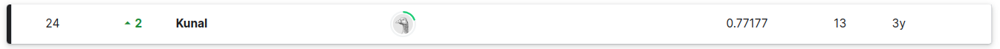

#   Computer Vision III (Deep Learning with PyTorch)

The notebook: `Project1_Kaggle_Competition_Classification.ipynb` was used to train a food classification challenge held in [Kaggle](https://www.kaggle.com/c/opencv-pytorch-dl-course-classification) conducted by OpenCV courses.


### About the Dataset

The dataset consisted of `8174` images in **13 Kenyan food type** classes. Sample images of **KenyanFood13 dataset** and the number of images in each of the classes are shown below:


Out of these `8174` image samples, `6536` samples were provided as a training set; while the remaining `1638` comprised of the hidden test data to be used during evaluation.

This train data was further split into a `80-20` train-validation split to perform training and evaluation.

---

### Classification Model used for Fine-tuning

[ResNext50_32x4d](https://pytorch.org/vision/stable/models/generated/torchvision.models.resnext50_32x4d.html#torchvision.models.resnext50_32x4d) was used for training the data. Since this dataset was not a subset of the ImageNet dataset, we chose to fine-tune `layer4` of the model, while freezing the previous layers in the feature extractor.


### Data augmentations

The following data augmentation from torchvision `transforms` were used to address overfitting:

```
ColorJitter(brightness = 0.6)
RandomChoice[
     RandomHorizontalFlip(),
     RandomVerticalFlip(),
     RandomRotation(20, fill=(0,0,0)),
     RandomCrop(224, padding=4),
     RandomAffine(30, translate=(0.3,0.3), scale=(0.8, 1.2), shear=None)
]
```


### Other Training Hyperparameters:

* Epochs: `50`

* Optimizer: `Adam` with initial LR: `1e-4` and weight decay: `1e-2`

* LR scheduler: `LambdaLR`

* Batch size: `16`

  

### Loss and Metric Plots


### Submission

The configurations discussed above, yielded a score of **0.77177** on the Leaderboard.



---

